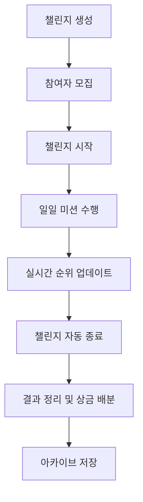

# Challenge! 🎯

**친구들과 함께하는 범용 챌린지 관리 플랫폼**


## 📋 프로젝트 개요

Challenge!는 친구들과 함께 다양한 챌린지를 생성하고 참여할 수 있는 웹 플랫폼입니다. 일일 미션 수행부터 실시간 순위 추적, 상금 배분까지 챌린지의 전체 라이프사이클을 지원합니다.

### ✨ 주요 특징

- 🎯 **범용 챌린지 시스템**: 운동, 독서, 습관 형성 등 모든 종류의 챌린지 생성 가능
- 📱 **모바일 우선 디자인**: 모바일 환경에 최적화된 반응형 UI
- 🤝 **친구와 함께**: 6자리 코드로 간편한 챌린지 참여
- 🏆 **실시간 순위**: 정교한 점수 계산 시스템과 실시간 랭킹
- 💰 **상금 시스템**: 참가비 기반 자동 상금 배분
- 🤖 **자동 관리**: 챌린지 시작/종료 자동화

---

## 🚀 주요 기능

### 🎯 챌린지 생성 (4단계 프로세스)
1. **기본 정보**: 제목, 참여 인원, 진행 기간 설정
2. **미션 설정**: Boolean/숫자형 미션, 입력 제한, 성공 조건
3. **평가 기준**: 꾸준함/총량/충실도 가중치, 연속 달성 보너스
4. **상금 설정**: 참가비 및 순위별 배분 비율

### 🤝 챌린지 참여
- 6자리 코드로 간편 참여
- 챌린지 정보 미리보기
- 참여 제한 검사 (인원, 중복 참여 등)

### 📱 일일 미션 수행
- 24시간 진행률 표시
- Boolean/숫자형 미션 입력 UI
- 미션 캐로셀 (다중 미션 지원)
- 실시간 참여자 현황

### 📊 챌린지 관리
- **현황 페이지**: 개인 성과, 최근 활동, 진행률
- **참여자 현황**: 스프레드시트 형태의 일일 진행 매트릭스
- **실시간 순위**: TOP 3 시상대, 상세 통계 분석
- **규칙 확인**: 상세한 챌린지 규칙 및 평가 기준

### 🏆 결과 및 아카이브
- **최종 결과**: 우승자 축하, 순위별 상금 배분
- **챌린지 아카이브**: 완료된 챌린지 기록 관리
- **전체 통계**: 참여 현황, 평균 달성률

### 🤖 자동화 시스템
- 챌린지 자동 시작/종료
- 상태별 UI 처리 (시작 대기/진행중/완료)
- 종료된 챌린지 미션 입력 차단

---

## 🛠 기술 스택

### Frontend
- **React 18** + **TypeScript** - 모던 웹 개발
- **Vite** - 빠른 개발 환경
- **Tailwind CSS v4.0** - 유틸리티 우선 CSS 프레임워크
- **React Router** - SPA 라우팅
- **Lucide React** - 아이콘 라이브러리

### Backend & Database
- **Supabase** - Backend as a Service
- **PostgreSQL** - 관계형 데이터베이스
- **실시간 구독** - 실시간 데이터 동기화

### Deployment
- **Vercel** - 자동 배포 및 호스팅
- **GitHub Actions** - CI/CD 자동화

### Design
- **Pretendard 폰트** - 한국어 최적화 폰트
- **모바일 우선** 반응형 디자인

---

## 🏗 프로젝트 구조

```
challengePage/
├── src/
│   ├── components/           # React 컴포넌트
│   │   ├── Home.tsx         # 홈 화면
│   │   ├── LoginForm.tsx    # 로그인
│   │   ├── SignupForm.tsx   # 회원가입
│   │   ├── Dashboard.tsx    # 대시보드 + 아카이브
│   │   ├── CreateChallenge.tsx      # 챌린지 생성 1단계
│   │   ├── CreateChallengeMissions.tsx    # 2단계
│   │   ├── CreateChallengeScoring.tsx     # 3단계
│   │   ├── CreateChallengePrizes.tsx      # 4단계
│   │   ├── JoinChallenge.tsx        # 챌린지 참여
│   │   ├── ChallengeMain.tsx        # 메인 챌린지 화면
│   │   ├── ChallengeOverview.tsx    # 챌린지 현황
│   │   ├── ChallengeParticipants.tsx # 참여자 현황
│   │   ├── ChallengeRanking.tsx     # 순위 및 통계
│   │   ├── ChallengeRules.tsx       # 규칙 확인
│   │   └── ChallengeResults.tsx     # 챌린지 결과
│   ├── contexts/
│   │   └── AuthContext.tsx  # 인증 상태 관리
│   ├── lib/
│   │   ├── supabase.ts      # Supabase 클라이언트 & API
│   │   └── scoring.ts       # 점수 계산 시스템
│   └── assets/              # 정적 파일
├── public/                  # 공개 파일
├── supabase_setup.sql      # 데이터베이스 스키마
└── PROJECT_CHECKLIST.md   # 개발 진행 상황
```

---

## 🗺 라우팅 구조

| 경로 | 컴포넌트 | 설명 |
|------|---------|------|
| `/` | Home | 홈화면 |
| `/login` | LoginForm | 로그인 |
| `/signup` | SignupForm | 회원가입 |
| `/dashboard` | Dashboard | 대시보드 + 아카이브 |
| `/create-challenge` | CreateChallenge | 챌린지 생성 1단계 |
| `/create-challenge/missions` | CreateChallengeMissions | 미션 설정 |
| `/create-challenge/scoring` | CreateChallengeScoring | 평가 기준 |
| `/create-challenge/prizes` | CreateChallengePrizes | 상금 설정 |
| `/join-challenge` | JoinChallenge | 챌린지 참여 |
| `/challenge/:id` | ChallengeMain | 메인 챌린지 화면 |
| `/challenge/:id/overview` | ChallengeOverview | 챌린지 현황 |
| `/challenge/:id/participants` | ChallengeParticipants | 참여자 현황 |
| `/challenge/:id/ranking` | ChallengeRanking | 순위 및 통계 |
| `/challenge/:id/rules` | ChallengeRules | 규칙 확인 |
| `/challenge/:id/results` | ChallengeResults | 챌린지 결과 |

---

## ⚙️ 설치 및 실행

### 1. 프로젝트 클론
```bash
git clone https://github.com/fridec13/challengePage.git
cd challengePage
```

### 2. 의존성 설치
```bash
npm install
```

### 3. 환경 변수 설정
`.env` 파일을 생성하고 Supabase 설정을 추가하세요:
```env
VITE_SUPABASE_URL=your_supabase_url
VITE_SUPABASE_ANON_KEY=your_supabase_anon_key
```

### 4. 데이터베이스 설정
`supabase_setup.sql` 파일의 SQL을 Supabase에서 실행하여 테이블을 생성하세요.

### 5. 개발 서버 실행
```bash
npm run dev
```

### 6. 빌드 (프로덕션)
```bash
npm run build
```

---

## 📊 데이터베이스 스키마

### 주요 테이블
- **`users`**: 사용자 정보 (닉네임, 핀코드, 프로필)
- **`challenges`**: 챌린지 기본 정보
- **`challenge_participants`**: 참여자 관계
- **`missions`**: 챌린지별 미션 정의
- **`mission_logs`**: 일일 미션 수행 기록

### 관계도
```
users (1) ──< challenge_participants (N) >── (1) challenges
challenges (1) ──< missions (N)
missions (1) ──< mission_logs (N) >── (1) users
```

---

## 🎯 핵심 시스템

### 점수 계산 시스템 (`ScoringSystem`)
```typescript
// 가중치 기반 점수 계산
총점 = (꾸준함 점수 × 꾸준함 가중치) + 
       (총량 점수 × 총량 가중치) + 
       (충실도 점수 × 충실도 가중치) + 
       연속 달성 보너스
```

- **꾸준함**: 연속 달성일 기반
- **총량**: 전체 완료율 기반  
- **충실도**: 정시 제출률 기반
- **연속 보너스**: 현재 연속일 × 보너스 점수

### 자동화 시스템
- **상태 관리**: `planning` → `active` → `completed`
- **자동 전환**: 시작일/종료일 기준 자동 상태 변경
- **UI 차단**: 종료된 챌린지 미션 입력 방지

---

## 📱 사용자 인터페이스

### 디자인 시스템
- **컬러**: Indigo 기반 그라데이션
- **타이포그래피**: Pretendard 폰트
- **아이콘**: Lucide React 일관성
- **레이아웃**: Mobile-first 반응형

### 주요 UI 패턴
- **카드 기반** 정보 표시
- **그라데이션** 배경 및 버튼
- **아이콘 + 텍스트** 조합
- **색상 코딩** 상태 표시

---

## 🔄 챌린지 라이프사이클



1. **생성**: 4단계 프로세스로 챌린지 설정
2. **참여**: 6자리 코드로 친구 초대
3. **진행**: 일일 미션 수행 및 실시간 랭킹
4. **종료**: 자동 종료 및 결과 계산
5. **정리**: 최종 순위 및 상금 배분
6. **아카이브**: 과거 챌린지 기록 보관

---

## 🎨 주요 기능 스크린샷 (텍스트 설명)

### 🏠 홈화면
- "Challenge!" 대형 타이틀
- 로그인/회원가입 버튼
- 그라데이션 배경

### 📊 대시보드
- 사용자 프로필 (이모지 아바타)
- 참여 중인 챌린지 상태
- 완료된 챌린지 아카이브 (최근 3개)
- 새 챌린지 생성/참여 버튼

### 🎯 챌린지 생성
- 4단계 프로그레스바
- 단계별 폼 인터페이스
- 미션 추가/삭제 UI
- 가중치 슬라이더

### 📱 메인 챌린지
- 24시간 진행률 바
- 미션 카드 (캐로셀)
- Boolean/숫자형 입력 UI
- 참여자 순위 미리보기

### 🏆 순위 시스템
- TOP 3 시상대 스타일
- 전체 순위 테이블
- 개인별 상세 통계
- 점수 구성 요소 분석

### 🏁 결과 페이지
- 우승자 축하 섹션 (Crown UI)
- 개인 결과 요약
- 상금 배분 결과
- 전체 챌린지 통계

---

## 🔧 개발 노트

### 설계 원칙
- **모바일 우선**: 모든 UI는 모바일에서 먼저 설계
- **편의성 중심**: 복잡한 검증보다는 사용 편의성 우선
- **친구용**: 친구들 간 사용 목적으로 보안보다는 UX 중심
- **실시간성**: 즉각적인 피드백 및 상태 반영

### 기술적 선택
- **TypeScript**: 타입 안정성으로 개발 생산성 향상
- **Tailwind CSS**: 빠른 프로토타이핑 및 일관된 디자인
- **Supabase**: 빠른 백엔드 구축 및 실시간 기능
- **Vercel**: 간편한 배포 및 자동화

### 성능 최적화
- 컴포넌트 레벨 상태 관리
- 불필요한 리렌더링 방지
- 모바일 최적화된 번들 크기

---

## 📈 프로젝트 현황

**개발 완료**: 2025년 7월 2일  
**진행률**: 🎉 **100% 완료** 🎉

### 완성된 주요 기능
- ✅ 사용자 인증 시스템
- ✅ 챌린지 생성 (4단계)
- ✅ 챌린지 참여 시스템
- ✅ 일일 미션 수행
- ✅ 실시간 순위 계산
- ✅ 자동 상태 관리
- ✅ 결과 정리 및 상금 배분
- ✅ 챌린지 아카이브

### 총 개발 기간
약 1개월 (2025년 6월 ~ 7월)

### 코드 통계
- **총 12개 페이지** (라우트)
- **15개 주요 컴포넌트**
- **TypeScript 100%** 사용
- **모바일 반응형** 완전 지원

---

## 🔮 향후 발전 방향

### 추가 고려 기능
- 📱 **푸시 알림**: 미션 알림, 순위 변동 알림
- 📊 **고급 통계**: 개인별 인사이트, 트렌드 분석
- 💬 **소셜 기능**: 응원 메시지, 댓글 시스템
- 🎨 **테마 시스템**: 다크모드, 커스텀 테마
- 📸 **미션 인증**: 사진/동영상 업로드
- 🏆 **배지 시스템**: 업적 달성 배지

### 확장 가능성
- **팀 챌린지**: 개인이 아닌 팀 단위 경쟁
- **시즌제**: 정기적인 시즌 챌린지
- **레벨 시스템**: 사용자 경험치 및 레벨
- **마켓플레이스**: 챌린지 템플릿 공유

---

## 🤝 기여하기

이 프로젝트는 개인 학습 목적으로 제작되었습니다. 

### 버그 리포트
이슈가 발견되시면 GitHub Issues를 통해 알려주세요.

### 기능 제안
새로운 기능 아이디어가 있으시면 언제든 제안해주세요!

---

## 📄 라이선스

이 프로젝트는 MIT 라이선스 하에 배포됩니다.

---

## 📞 연락처

**개발자**: [GitHub Profile](https://github.com/fridec13)  
**프로젝트**: [Challenge! Repository](https://github.com/fridec13/challengePage)  
**데모**: [Live Demo](https://challenge-page.vercel.app)

---

<div align="center">

**⭐ 이 프로젝트가 도움이 되었다면 Star를 눌러주세요! ⭐**

*만든 날짜: 2025년 7월 2일*

</div>
